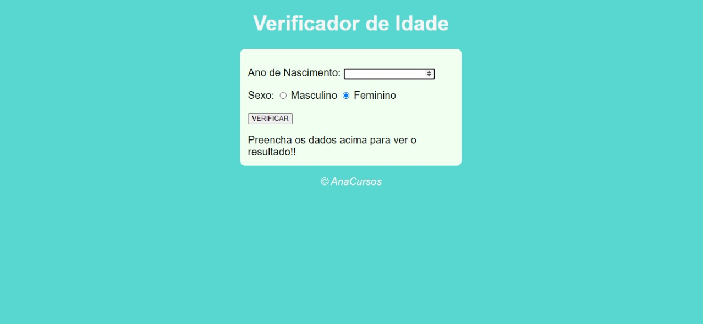

> :CursoemVideo: Calcula a idade e com base no sexo mostra uma foto com uma pessoa nesta mesma faixa de idade

    <a href="README-pt.md">Portuguese</a>
 

   Projeto Master Discover. Construido com  ❤ por
    <a href="https://github.com/AnaPaulaSouzaDias">Ana Paula</a>  
  

   
   
   
   

# :computer: Tecnologias
Este projeto usou as seguintes tecnologias

* [Html]  
* [Css]
* [Javascript]   
     
# Clonar repositorio
$ git clone https://github.com/AnaPaulaSouzaDias/Calcular_Idade

Feito com amor por [Ana Paula Souza Dias](https://github.com/AnaPaulaSouzaDias/Calcular_Idade) 🚀.
Este projeto esta pela licença [MIT license](./LICENSE).

Deixe uma ⭐ se este projeto te ajudou